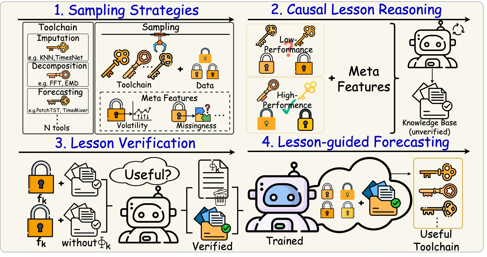

# Bootstrapped Exploration with Causal Reasoning

<p align="center">
  <strong>A Training Paradigm for Adaptive Forecasting Agent</strong>
  <br>
  <strong>BECRA</strong>
</p>

<p align="center">
  <a href="https://openreview.net/forum?id=8d2LLxwU1r">
    
  </a>
  <a href="https://openreview.net/pdf?id=8d2LLxwU1r">
    
  </a>
  <a href="https://github.com/Adaptive-Forecasting-Agent/BECRA">
    
  </a>
  <a href="#citation">
    
  </a>
</p>

BECRA is an agent training paradigm for adaptive time-series forecasting. Instead of hand-tuning a fixed forecasting pipeline for every dataset, BECRA learns **symbolic strategy lessons** through contrast-aware exploration and agent-level causal reasoning, then reuses those lessons for **zero-shot, lesson-guided planning** on unseen datasets.

Real-world time series are heterogeneous: they differ in volatility, seasonality, missingness, anomaly patterns, cross-variate structure, and distribution shift. No single forecasting model or preprocessing chain is universally optimal. BECRA treats forecasting as an **agent decision problem**: given dataset meta-features, the agent composes a multi-stage toolchain across imputation, anomaly handling, transformation, decomposition, normalization, and forecasting, while accumulating transferable knowledge that can be verified, stored, retrieved, and reused at deployment time.

<p align="center">
  
  <br>
  <em>Overview of the four-stage BECRA training and adaptation cycle.</em>
</p>

## Highlights

| Capability | What BECRA Adds |
| --- | --- |
| **Adaptive forecasting agents** | Reframes forecasting as strategy selection over a modular toolchain rather than a fixed model choice. |
| **Bootstrapped exploration** | Uses contrast-aware UCB sampling to collect informative successes and failures without human strategy labels. |
| **Causal lesson memory** | Distills conditional, symbolic lessons that explain when particular strategy decisions help or hurt. |
| **Controlled verification** | Tests each candidate lesson through paired planner interventions before accepting it into memory. |
| **Zero-shot holdout planning** | Transfers verified lessons to unseen datasets for stage-wise toolchain planning and final evaluation. |

## Four-Stage Pipeline

Following the paper, BECRA trains an adaptive forecasting agent through a four-stage cycle: it explores forecasting strategies, abstracts the observed contrasts into causal lessons, verifies those lessons through controlled policy interventions, and finally applies the validated lesson memory to unseen datasets through in-context planning.

### 1. Exploratory Construction of Forecasting Strategies

BECRA searches over a combinatorial space of time-series processing tools and forecasting models. Rather than only exploiting high-reward pipelines, contrast-aware UCB sampling deliberately retains both strong and weak strategy outcomes under comparable dataset meta-feature conditions, creating the empirical evidence needed for causal comparison.

### 2. Extracting Strategy Lessons via Contrastive Causal Reasoning

The agent then contrasts successful and unsuccessful toolchain executions to induce symbolic strategy lessons. Each lesson describes when a strategy is likely to be effective or ineffective, linking dataset characteristics to agent-level strategy choices rather than modeling the underlying data-generating process directly.

### 3. Lesson Verification via Controlled Policy Interventions

Because induced lessons are hypotheses, BECRA verifies them before using them downstream. For each candidate lesson, the planner is evaluated with and without that lesson as a planning prior; only lessons that induce a consistent positive outcome difference under fixed dataset conditions are retained.

### 4. Forecasting with Lesson-Guided Planning

At deployment time, BECRA retrieves validated lessons that match the meta-features of a new dataset and injects them into the planner as symbolic priors. The agent composes a forecasting toolchain without additional parameter updates, enabling zero-shot training adaptation to previously unseen forecasting tasks.

## Installation

### Conda

```bash
conda env create -f environment.yml
conda activate becra
```

### pip

```bash
python -m venv .venv
source .venv/bin/activate
pip install -r requirements-becra.txt
```

If you run GPU experiments, install a PyTorch build compatible with your CUDA version before launching the pipelines.

## LLM Configuration

Paper-style runs in Stages 2-4 use an OpenAI-compatible LLM endpoint for lesson induction, verification-time planning, and lesson-guided target planning. Set these variables before launching the holdout scripts:

```bash
export BECRA_LLM_BASE_URL="https://your-endpoint/v1"
export BECRA_LLM_API_KEY="your_api_key"
export BECRA_LLM_MODEL="your_model_name"
```

Optional GPU assignment:

```bash
export BECRA_GPUS="0 1"
```

## Data Preparation

BECRA follows the standard long-term forecasting benchmark data format used by [Time-Series-Library](https://github.com/thuml/Time-Series-Library). You can obtain the well-preprocessed datasets from the official Time-Series-Library mirrors: [Google Drive](https://drive.google.com/drive/folders/13Cg1KYOlzM5C7K8gK8NfC-F3EYxkM3D2?usp=sharing), [Baidu Drive](https://pan.baidu.com/s/1r3KhGd0Q9PJIUZdfEYoymg?pwd=i9iy), or [Hugging Face](https://huggingface.co/datasets/thuml/Time-Series-Library).

After downloading, place the six benchmark CSV files under `data/` using the paths expected by `becra/config.py`.

```text
data/
├── ETT-small/
│   ├── ETTh1.csv
│   ├── ETTh2.csv
│   ├── ETTm1.csv
│   └── ETTm2.csv
├── electricity/
│   └── electricity.csv
└── weather/
    └── weather.csv
```

These correspond to the Weather, ETT, and Electricity benchmarks used in the paper's long-term forecasting experiments.

## Quick Start

Run the full six-dataset holdout suite in the background:

```bash
bash scripts/launch_all_holdouts.sh
```

The launcher prints a batch ID, process ID, and log path. Follow the run with:

```bash
tail -f logs/all_holdouts_<BATCH_ID>/nohup.out
```

Run the same suite in the foreground:

```bash
bash scripts/run_all_holdouts_sequential.sh
```

Default order:

```text
Weather -> ETTm2 -> Electricity -> ETTh1 -> ETTh2 -> ETTm1
```

Resume from a specific holdout or run only one target:

```bash
bash scripts/run_all_holdouts_sequential.sh --from electricity
bash scripts/run_all_holdouts_sequential.sh --only ettm2
```

## Single-Holdout Runs

Each script below executes `Explore -> Induce -> Verify -> Run` for one target dataset. Existing outputs for that target are archived before a fresh run starts.

```bash
bash scripts/run_weather_holdout_pipeline.sh
bash scripts/run_ettm2_holdout_pipeline.sh
bash scripts/run_electricity_holdout_pipeline.sh
bash scripts/run_etth1_holdout_pipeline.sh
bash scripts/run_etth2_holdout_pipeline.sh
bash scripts/run_ettm1_holdout_pipeline.sh
```

Detached mode is available for long runs:

```bash
bash scripts/run_weather_holdout_pipeline.sh --nohup
```

## Low-Level CLI

Advanced users can invoke individual stages through `scripts/run_becra_long_term.py`.

```bash
python scripts/run_becra_long_term.py profile --datasets Weather
python scripts/run_becra_long_term.py explore --datasets ETTh1 ETTh2 ETTm1 ETTm2 Electricity --rounds 2
python scripts/run_becra_long_term.py induce --datasets ETTh1 ETTh2 ETTm1 ETTm2 Electricity --use-llm
python scripts/run_becra_long_term.py verify --datasets ETTh1 ETTh2 ETTm1 ETTm2 Electricity --paired-rollout
python scripts/run_becra_long_term.py run --datasets Weather
```

Use `--help` on any subcommand for the full set of stage-specific options.

## Citation

If BECRA is useful for your research, please cite:

```bibtex
@inproceedings{zeng2026becra,
  title     = {Bootstrapped Exploration with Causal Reasoning: A Training Paradigm for Adaptive Forecasting Agent},
  author    = {Qingwen Zeng and Dajun Guo and Zhaoge Bi and Lining Chen and Jushang Qiu and Yitian Yang and Carl Yang and Huaming Chen and Ling Chen},
  booktitle = {Forty-third International Conference on Machine Learning},
  year      = {2026}
}
```
